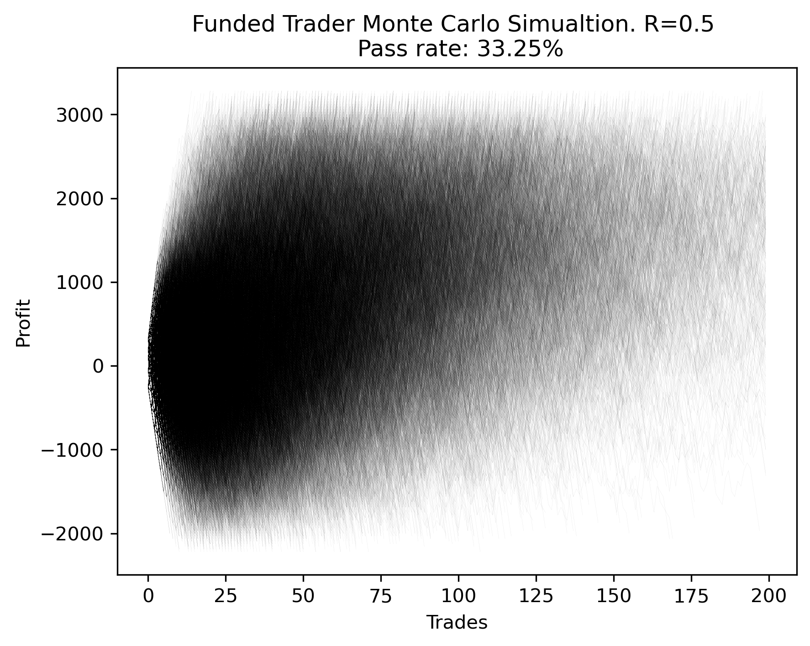

# Prop Firm Monte Carlo

## What is it?
A simple python script that uses monte carlo methods to estimate how many traders will pass a funded trader evaluation based on the rules.

## Installation
- Install Conda: https://www.anaconda.com/download/
- Open conda command line
- Create new conda environment
`conda create --name montecarlo`
- Install dependencies from requirements.txt into new conda environment
`conda install --file requirements.txt`
- Run script
`python montecarlo.py`

## Sharing
I'm betting many people will want to extend the script to include additional rules for different prop firms.  I'd recommend forking this repository here on Github so that others can find your changes.
